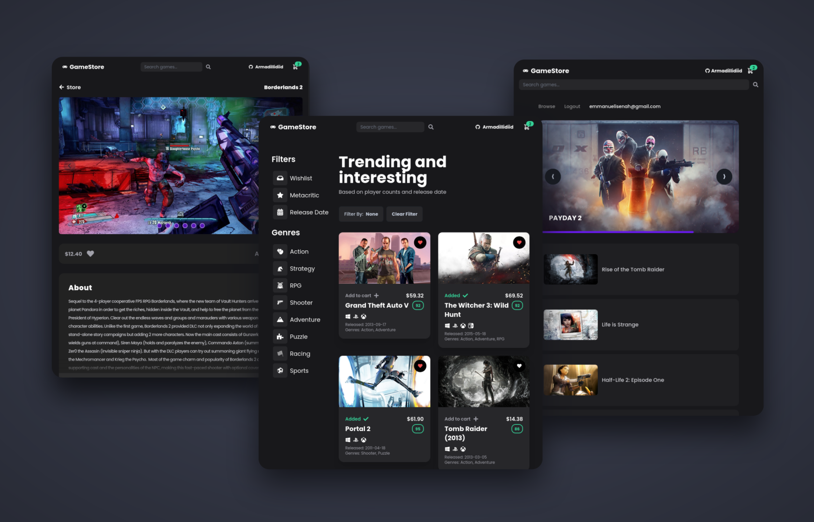

<h1 align="center">🎮 React Game Store</h1>

<p align="center">
    
</p>
<p align=center>Built with React </p>

## Description 📝

<p>Game Store is a web application built with React for the frontend and Firebase for authentication and database management. It utilizes the RAWG API to fetch details of games such as release date, images, metacritic score and other relevant information.</p> 

## Live Demo 🔴

<p>You can view a live demo by clicking <a href="https://armadillidiid.github.io/react-game-store/">HERE</a></p>

## Screenshots


## Built with

- React
- Tailwind
- Firebase
- Jest
- Cypress
- Framer Motion

## Installation

To run the application on your local machine, follow these steps:
  1. Clone the repository to your local machine.

```sh
git clone https://github.com/Armadillidiid/react-game-store.git
```

2. Install the required dependencies.

```sh
npm install
```

3. [Create a RAWG account](https://rawg.io/apidocs) to get your API key.
4. Set your API key by adding it to fetch queries.
5. Run the project.

```sh
npm run dev
```